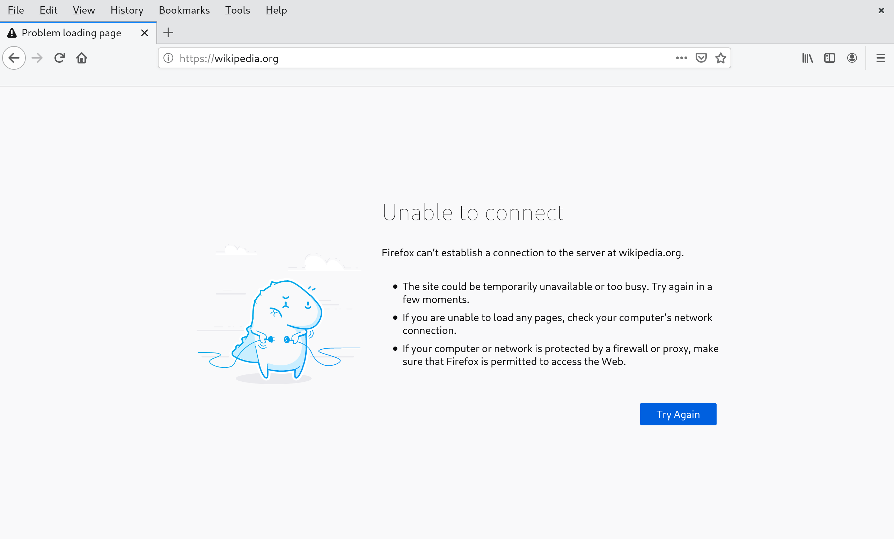

Blockit
----

Website blocker written in Python.


## 💻 Usage

Run "python blockit.py" and enter the domain you wish to block.
```	
$ python blockit.py
Please enter the domain:
wikipedia.org

wikipedia.org was added.
```

Then open your browser and enter the domain. You should see something like this:




